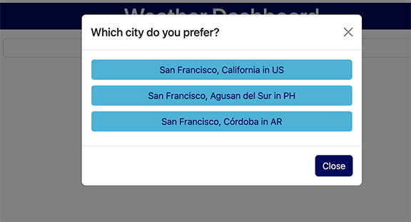
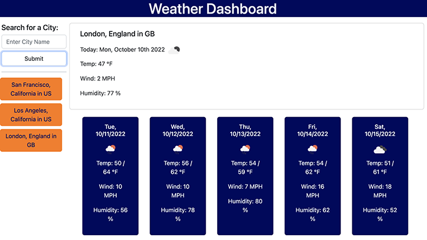

# weather
5 day weather outlook for city of user's choice

UCLA Bootcamp Challenge 6 - Module 6

Due Date 10/10/2022

## Challenge Tasks

Build a weather dashboard that retrieves data from [5 Day Weather Forecast's](https://openweathermap.org/forecast5) weather data for cities that will run in browser and feature dynamically updated HTML and CSS.

## User Story

```
AS A traveler
I WANT to see the weather outlook for multiple cities
SO THAT I can plan a trip accordingly
```

## Requirements

- Create weather dashboard with a form input
- search for a city name
- return 3 options for city, state and country that matches the city name (see image below)



- add chosen city information to search history
- return the current weather condition for that city
- provide city name, current date, icon representing weather condition, temperature, wind speed, and humidity percentage.
- In addition provide a 5 day weather forcast with all above infomation
- click on search history and be presented with current and future conditions for that city (see image below)




## Final Submission

1. Weather Dashboard is deployed and can be seen at: [Weather forecast](https://me-ross.github.io/weather/)

2. Repository for Weather Dashboard application can be found at: [GitHub](https://github.com/Me-ross/weather)

